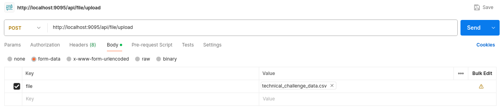

# BI Challenge Mercado Libre

Aplicación BackEnd que mediante el consumo de un archivo, que
contiene código de sitio y código de ítem, se comunica con
los servicios de la API pública de Mercado Libre.

De dichos servicios se obtienen, para cada ítem, el nombre de
la categoría, la descripción de la moneda, el nickname del
usuario, el precio y la fecha de inicio.

La información recopilada es almacenada en una tabla de base
de datos.
---

## Pre requisitos

### Herramientas

- Git - v2.45.2
- Maven - v3.9.7
- Docker - v26.1.4
- Docker Compose - v2.28.1

### Tecnologías

- OpenJDK 17
- Spring Boot - v3.2.7
- Spring WebFlux
- Spring R2DBC

---

## Librerías de terceros

- [org.apache.commons.commons-csv](https://mvnrepository.com/artifact/org.apache.commons/commons-csv)
- [com.fasterxml.jackson.core.jackson-databind](https://mvnrepository.com/artifact/com.fasterxml.jackson.core/jackson-databind)
- [io.github.resilience4j.resilience4j-circuitbreaker](https://mvnrepository.com/artifact/io.github.resilience4j/resilience4j-circuitbreaker)
- [io.github.resilience4j.resilience4j-reactor](https://mvnrepository.com/artifact/io.github.resilience4j/resilience4j-reactor)

---

## Instalación

- Abrir una terminal de comandos
- Clonar el proyecto

~~~
git clone https://github.com/oaarangov-hub/meli-challenge.git
~~~

- Instalar dependencias

~~~
mvn install
~~~

---

## Configuración

### En código fuente

En el directorio del proyecto, ir a la ruta `src/main/resources/application.properties`

| Llave                  | Valor                               |
|------------------------|-------------------------------------|
| file.content.separator | Ver sección **Consumo de archivos** |
| file.content-type      | Ver sección **Consumo de archivos** |
| file.content.encoding  | Ver sección **Consumo de archivos** |

### En compose

En el directorio del proyecto, abrir el archivo `docker-compose.yml`

| Llave                  | Valor                               |
|------------------------|-------------------------------------|
| FILE_CONTENT_TYPE      | Ver sección **Consumo de archivos** |
| FILE_CONTENT_SEPARATOR | Ver sección **Consumo de archivos** |
| FILE_CONTENT_ENCODING  | Ver sección **Consumo de archivos** |

---

## Ejecución

- Abrir una terminal de comandos
- Ubicarse en el directorio del proyecto
- Ejecutar docker compose

~~~
docker-compose up --build
~~~

### Rutas

Durante su ejecución (local), la aplicación estará disponible en la
ruta http://localhost:9095/api

| Ruta         | body             | Descripción                                                         |
|--------------|------------------|---------------------------------------------------------------------|
| /file/upload | Tipo `form-data` | Ruta para cagar el archivo. El nombre del párametro debe ser `file` |

### Consumo de archivos

Para el consumo de archivos deben parametrizarse:

| Tipo de archivo | Separador            | Encoding                                              |
|-----------------|----------------------|-------------------------------------------------------|
| text/csv        | `,` `;`              | Parametrizable según archivo origen                   |
| text/plain      | `,` `;` `\|` `-` `_` | Diferentes a los señálados, pueden no ser compatibles |
| JSON            | N/A                  | Estándar                                              |

### Prueba de carga

Ejemplo de consumo en Postman

### Consulta a base de datos

Puede ser accedida desde cualquier FrontEnd compatible con
PostgreSQL (pgAdmin, phpAdmin, DBeaver)

#### Credenciales

- **Base de datos**: challenge
- **Usuario**: postgres
- **Contraseña**: adminadmin
- **Puerto**: 5435
- **Tabla**: records

---

## Autor

[Óscar Alberto Arango Vásquez](https://www.linkedin.com/in/oarangov/)